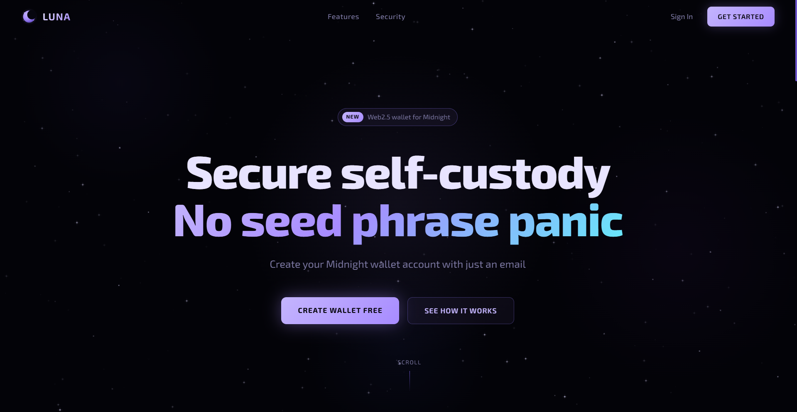
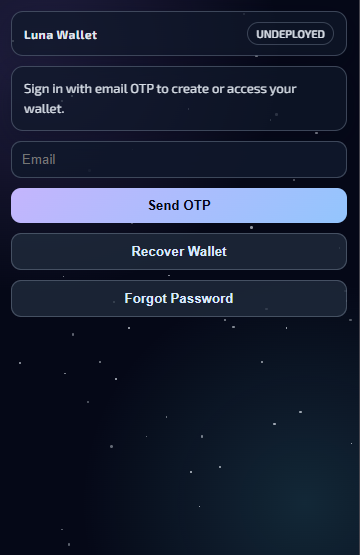

# 🌑 Luna — Web2.5 wallet for Midnight Network

Luna is a non-custodial browser wallet for the [Midnight Network](https://midnight.network) that brings Web2-level simplicity to Web3 wallets.




## ✨ Capabilities

- Login with email
- Downloadable backup file (easy to store in multiple places)
- Backup file leak safety (backup file alone cannot drain funds)
- Forget/reset password flow
- Restore wallet on any device with email + backup file + password
- NIGHT balance viewing
- Dust generation
- Network switching across 4 networks
- View/copy addresses: shielded, unshielded, and dust
- Address QR display
- Send NIGHT tokens

---

## 📁 Project Structure

```
luna/
├── frontend/       # React + TypeScript site + wallet web app
├── backend/        # Express + TypeScript API (auth, backup, dApp relay)
└── extension/      # Browser extension (Manifest V3, React popup)
```

---

## 🚀 Setup And Run

### Prerequisites
- Node.js 18+
- npm

### 1. Clone Repository

```bash
git clone https://github.com/ShivRaiGithub/Luna
cd luna
```

### 2. Install Packages

Install dependencies for all apps:

```bash
cd frontend && npm install
cd ../backend && npm install
cd ../extension && npm install
cd ..
```

### 3. Configure Environment Variables

Only backend requires an env file.

```bash
cd backend
cp .env.example .env
```

Then edit `.env` and set at least:

- `JWT_SECRET`
- `SMTP_USER`
- `SMTP_PASS`
- `CORS_ORIGIN` (usually `http://localhost:3000`)
- `MONGODB_URI`

### 4. Run The Repo (Development)

Open separate terminals from repo root:

Terminal 1 (backend):

```bash
cd backend
npm run dev
```

Terminal 2 (frontend):

```bash
cd frontend
npm start
```

Optional Terminal 3 (extension watch build):

```bash
cd extension
npm run dev
```

App URLs:

- Frontend: `http://localhost:3000`
- Backend: `http://localhost:3001`

---

**Load Extension in Chrome:**
1. Go to `chrome://extensions`
2. Enable "Developer mode"
3. Click "Load unpacked"
4. Select the `extension/dist/` folder

---

## 📝 HOW SUCH A "WEB2.5" THING IS POSSIBLE:
1. An instance of the private key is encrypted with user's password and never leaves the user's browser. This allows user to login back into wallet with just the email and password. No OTP or backup file required.
2. This is how the recovery through backup file and password reset actually works, and how backup file is used (This is where the magic happens):   
Private key is copied into 2 strings, one encrypted by password while the other with backup pass, both then broken into 2 halves. One pair of halves is stored on server while the other in backup file. Neither can fully construct the private key without the other.   
Hence, to access the part on server, you need email access and otp. To access the other one, you need the backup file. And to decrypt, you need the password. Not one, but 3 things. That's what makes it secure. Even if the backup file leaks, no one can reconstruct the private key without the password and email access.


---

## 📄 License

MIT — Built for the Midnight ecosystem.
